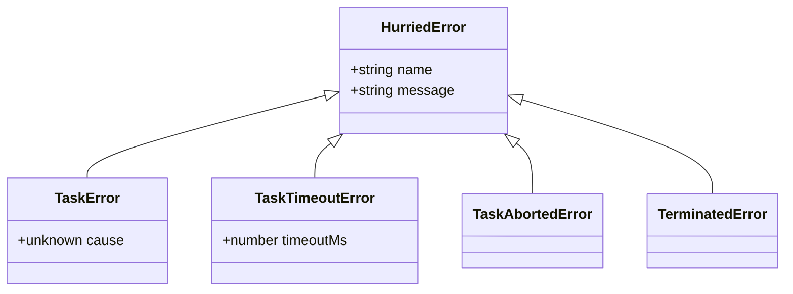

# Error hierarchy

All hurried errors extend `HurriedError`, so you can `instanceof HurriedError` to detect anything from the library.



## `HurriedError`

Base class. `instanceof HurriedError` matches every other library error.

## `TaskError`

A handler threw or rejected. The original error is on `.cause`:

```ts
try {
  await thread.run('process', data);
} catch (e) {
  if (e instanceof TaskError) {
    console.error('handler failed:', e.cause);
  }
}
```

## `TaskTimeoutError`

The call exceeded its `timeout`. `.timeoutMs` carries the configured deadline.

```ts
try {
  await thread.run(arg, { timeout: 500 });
} catch (e) {
  if (e instanceof TaskTimeoutError) retryWithLongerTimeout();
}
```

## `TaskAbortedError`

An `AbortSignal` fired during the call.

```ts
const controller = new AbortController();
setTimeout(() => controller.abort(), 100);

try {
  await thread.run(arg, { signal: controller.signal });
} catch (e) {
  if (e instanceof TaskAbortedError) { /* swallow */ }
}
```

## `TerminatedError`

The worker was terminated mid-flight (manually via `terminate()` or because it exited).

```ts
const promise = thread.run(arg);
await thread.terminate();        // promise rejects with TerminatedError
```
