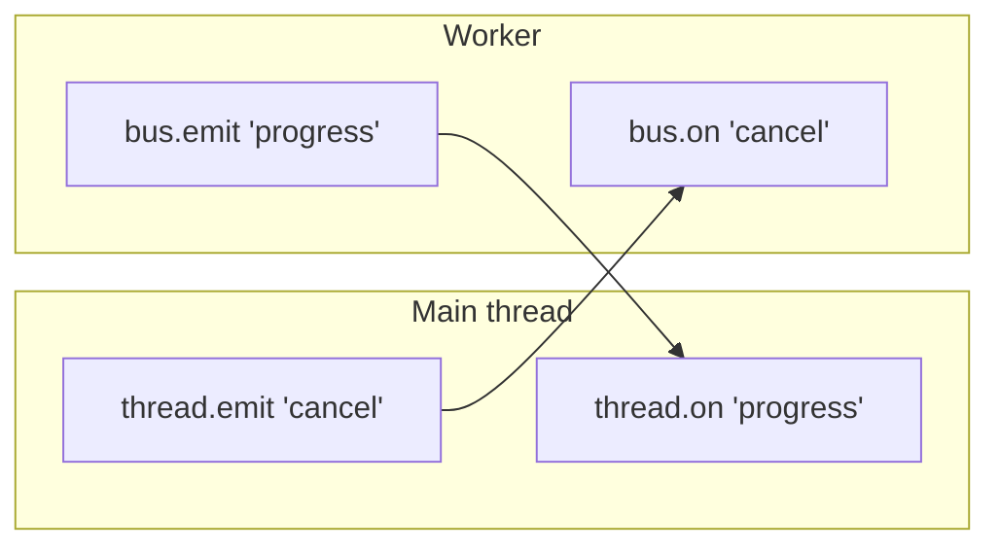

# The Bus

The Bus is the feature that makes **hurried** different from every other worker library.

> **One event map. Two endpoints. Zero `any`.**
>
> Declare a single `type Events` and both sides of the worker boundary speak the same typed language.

## The mental model

You declare an `Events` map once. The main thread uses `thread.on / emit / once`. The worker uses the same API via the `bus` argument (inline) or `workerBus()` (file). Payloads are inferred. Renaming a field breaks both sides at compile time.



## The simplest possible example

```ts
import { Thread } from 'hurried';

type Events = {
  progress: { done: number; total: number };
  log: string;
  cancel: void;                            // payload-less event
};

const thread = Thread.fromFunction<Events, number, number>((bus, n) => {
  bus.emit('log', `starting with n=${n}`);
  for (let i = 0; i < n; i++) {
    if (i % 1_000_000 === 0) {
      bus.emit('progress', { done: i, total: n });
    }
  }
  return n;
});

thread.on('progress', (p) => console.log(`${p.done}/${p.total}`));
thread.on('log',      (m) => console.log(`[worker] ${m}`));

await thread.run(50_000_000);
thread.emit('cancel');                    // void → no payload arg
await thread.terminate();
```

:::tip First parameter convention
Inline tasks with **two or more declared parameters** receive a `Bus<TEvents>` as the first argument. Single-param tasks (`(n) => …`) keep the simple no-bus shape. So either of these is valid:

```ts
Thread.fromFunction((n: number) => n * 2);                     // no bus
Thread.fromFunction<Events, number, number>((bus, n) => …);    // typed bus
```
:::

## The Bus API

The five methods you'll use:

```ts
bus.emit(event, payload?)              // send to the other side
const off = bus.on(event, listener)    // subscribe; off() to remove
bus.once(event, listener)              // one-shot subscribe
bus.off(event, listener)               // manually remove
const payload = await bus.waitFor(event, { signal? })   // Promise<TEvents[event]>
```

Plus two helpers when you want them:

```ts
bus.clear()                            // remove every listener
bus.listenerCount(event?)              // diagnostics
```

### `on()` returns its own unsubscribe

```ts
const off = thread.on('progress', render);
// later:
off();        // clean detach
```

No need to keep the listener reference around.

### Void events

Some events don't need a payload. Use `void`:

```ts
type Events = { cancel: void; tick: void };

thread.emit('cancel');               // no second arg required
thread.emit('tick');

thread.on('cancel', () => console.log('bye'));
```

TypeScript enforces this with the `EmitArgs` helper type.

### `waitFor` — promise-style awaits

```ts
type Events = { ready: { version: string } };

const { version } = await thread.bus().waitFor('ready', { signal });
console.log(`worker ${version} is ready`);
```

Combine with `AbortSignal` for cancellable awaits.

## Inline tasks vs file-based workers

You can use the Bus two ways depending on how complex the worker is.

### Inline (simple)

The task is serialized to source, so it can't reference closure variables — but it gets a `bus` argument out of the box.

```ts
const thread = Thread.fromFunction<Events, number, number>((bus, n) => {
  bus.emit('progress', { done: 0, total: n });
  return n;
});
```

### File-based (recommended for non-trivial logic)

You can `import` anything you want and reach for the bus via `workerBus<Events>()`:

```ts
// worker.ts
import { defineWorker, workerBus } from 'hurried';
import { someBigDependency } from './deps.js';

export type Events = { progress: { done: number; total: number } };
const bus = workerBus<Events>();

export default defineWorker({
  process(items: string[]) {
    items.forEach((it, i) => {
      someBigDependency(it);
      bus.emit('progress', { done: i + 1, total: items.length });
    });
    return items.length;
  },
});
```

```ts
// main.ts
import { Thread } from 'hurried';
import type { Events } from './worker.js';

const thread = Thread.fromFile<Events>(new URL('./worker.js', import.meta.url));
thread.on('progress', (p) => render(p));
await thread.run('process', ['a', 'b', 'c']);
```

## Pools and the Bus

The Bus surface is identical on pools — events from any worker are aggregated, and `pool.emit()` broadcasts to all workers.

```ts
const pool = new Pool<Events, number, number>({ size: 4, task });

pool.on('progress', (p) => console.log(p));    // from ANY worker
pool.emit('cancel');                            // to ALL workers
```

See [Aggregated events](../patterns#4-aggregated-events-from-many-workers) for the full pattern.

## Caveats

### Tight loops won't process incoming bus messages

Node workers can only process incoming messages when the event loop drains. If your worker is inside a sync loop, incoming `bus.on()` events queue up but listeners don't run until the loop ends.

For cooperative cancellation, yield periodically:

```ts
async (bus, n) => {
  let stop = false;
  bus.on('cancel', () => { stop = true; });

  const chunk = 5_000_000;
  for (let i = 0; i < n; i += chunk) {
    if (stop) return 'cancelled';
    for (let j = 0; j < chunk; j++) work(i + j);
    await new Promise((r) => setImmediate(r));   // ← drain the queue
  }
  return 'done';
}
```

See the [cooperative cancellation pattern](../patterns#3-cooperative-cancellation-through-the-bus) for the full example.

### Payloads must be structured-cloneable

Bus payloads cross the worker boundary via Node's structured clone algorithm — same rules as `postMessage`. Functions, DOM nodes, and class instances with custom prototypes won't survive. Plain objects, typed arrays, `Map`, `Set`, `Date` all work.
